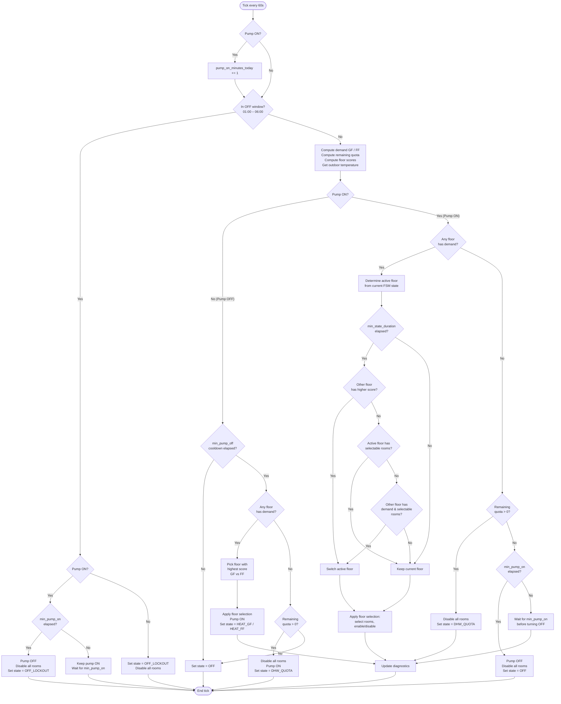

# Heat Orchestrator – Decision Flowcharts

## 1. Per-Tick Decision Flow

This flowchart describes the logic executed every 60 seconds by the `_tick()` method.

## 2. Overall Process Overview

This flowchart shows the high-level architecture: system components, FSM states, and how they relate.

## Legend

| Symbol | Meaning |
|--------|---------|
| Solid arrows (`-->`) | Direct action / data flow |
| Dashed arrows (`-.->`) | State transitions |
| Diamond `{}` | Decision point |
| Rounded rectangle `([])` | Start / end / event |
| Rectangle `[]` | Action / process |

## Key Concepts

- **Tick**: The main control loop runs every 60 seconds
- **OFF Window**: Nightly forced-off period (default 01:00–06:00) when the pump must not run
- **Demand**: A room needs heating when its current temperature falls below the user setpoint minus hysteresis
- **Floor Exclusivity**: Only one floor (GF or FF) can heat at a time — never both
- **LERP**: The number of rooms heated simultaneously scales linearly with outdoor temperature
- **DHW Quota**: When no rooms need heating, the pump may still run to meet a daily minimum run-time for domestic hot water
- **Cooldown**: Rooms that have been heating continuously for too long are forced into a cooldown period
- **Automation Guard**: Prevents automation-driven setpoint changes from being recorded as user changes
